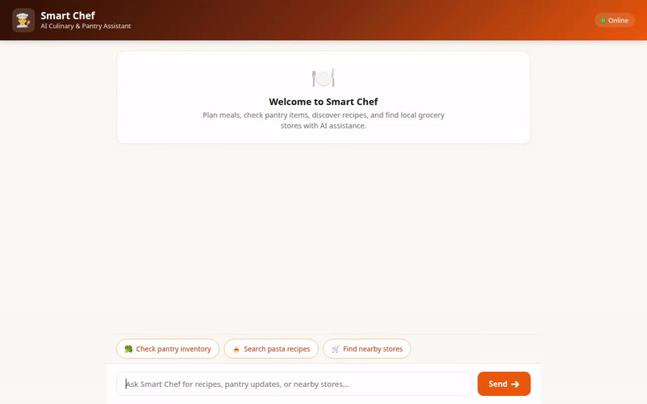

# Smart Chef — AI Culinary & Meal Planning Assistant

Smart Chef is an intelligent, multi-tool AI assistant built with Google's **Agent Development Kit (ADK)** and powered by **Gemini 2.5 Flash**. Smart Chef helps users discover recipes, manage pantry inventory, respect strict food allergies, locate nearby grocery stores, and generate rich media (AI photos, SVG visuals, and culinary videos).



---

## 🌟 Key Features

All capabilities listed below are fully implemented in [`app/agent.py`](app/agent.py) and wired to live Google Cloud services:

* **🧠 Cross-Session Long-Term Memory (Vertex AI Memory Bank)**
  * Automatically extracts and remembers user dietary restrictions, food allergies (e.g., peanut, gluten, dairy), and cooking preferences across sessions.
  * Proactively enforces safety rules to exclude allergens from all recommended meals.

* **🥫 Pantry Inventory Management (Google Cloud Firestore)**
  * Reads real-time pantry inventory (`check_pantry_inventory`).
  * Updates item quantities and adds new ingredients (`update_pantry_item`) in Firestore.

* **🌐 Real Recipe Search & Retrieval**
  * Queries real-world online recipes, ingredients, and instructions via **TheMealDB API** (`fetch_external_recipes`).
  * Performs fast local recipe searches (`search_recipes`).

* **📸 AI Recipe Photography (Vertex AI Imagen / Gemini Flash Image)**
  * Generates high-quality dish photos using `gemini-3.1-flash-lite-image` (`generate_recipe_photo`).
  * Creates clean SVG dish diagrams (`generate_dish_image`).
  * Uploads generated images directly to a public **Google Cloud Storage** bucket and returns public HTTPS URLs.

* **🎥 AI Video Generation (Vertex AI Gemini Omni)**
  * Generates short culinary videos using Google's **`gemini-omni-flash-preview`** in the `global` region (`generate_recipe_video`).
  * Saves video artifacts for display in the ADK Playground and uploads raw MP4 bytes to Google Cloud Storage.

* **📍 Geocoding & Nearby Grocery Stores (Google Maps Platform API)**
  * Geocodes user addresses into latitude/longitude coordinates (`geocode_address`).
  * Finds nearby supermarkets and grocery stores with exact ratings and addresses using Google Maps Places API (`find_nearby_places`).

* **🎨 Rich Interactive Cards (A2UI v0.8)**
  * Emits structured display cards, tables, and image layouts via an `after_model_callback` for rich UI frontends.

* **🐍 Sandboxed Python Code Executor**
  * Executes Python code safely in a sandbox environment for dynamic unit conversions and scaling recipe yields.

---

## 🛠️ Google Cloud & External Integrations

| Service / Tool | Purpose | Implementation File |
| :--- | :--- | :--- |
| **Vertex AI Agent Engine** | Serverless Agent Runtime deployment | `agents-cli-manifest.yaml` |
| **Vertex AI Memory Bank** | Persistent user memory service | `app/agent.py` (`PreloadMemoryTool`) |
| **Vertex AI Gemini Omni** | Short video generation (`gemini-omni-flash-preview`) | `app/agent.py` (`generate_recipe_video`) |
| **Vertex AI Flash Image** | Dish photo generation (`gemini-3.1-flash-lite-image`) | `app/agent.py` (`generate_recipe_photo`) |
| **Google Cloud Firestore** | Pantry inventory persistence | `app/agent.py` (`check_pantry_inventory`) |
| **Google Cloud Storage** | Dish image & video asset hosting | `app/agent.py` (`storage.Client`) |
| **Google Maps Platform** | Geocoding & Places search | `app/agent.py` (`geocode_address`, `find_nearby_places`) |
| **TheMealDB API** | External recipe data fetching | `app/agent.py` (`fetch_external_recipes`) |

---

## 🚀 Local Setup & Deployment Instructions

### Prerequisites
* Python 3.11+
* `uv` package manager (`pip install uv`)
* `gcloud` CLI authenticated with Google Cloud Platform
* Google Maps API Key set as `GOOGLE_MAPS_API_KEY`

### 1. Install Dependencies
```bash
uv sync
```

### 2. Environment Configuration
Set required environment variables:
```bash
export GOOGLE_CLOUD_PROJECT="YOUR_GCP_PROJECT_ID"
export GOOGLE_CLOUD_LOCATION="us-central1"
export GOOGLE_MAPS_API_KEY="YOUR_KEY"
```

### 3. Run Agent Playground Locally
Start the ADK Web Playground with hot-reloading and Memory Bank support:
```bash
uv run adk web . --port 8080 --reload_agents --memory_service_uri=agentengine://YOUR_MEMORY_BANK_ID
```

### 4. Run Custom FastAPI Frontend Locally
Navigate to the `frontend` directory and start the chat UI server:
```bash
cd frontend
export AGENT_ENGINE_RESOURCE_NAME="projects/YOUR_PROJECT/locations/us-east1/reasoningEngines/YOUR_ENGINE_ID"
export AGENT_DIRECTORY="app"
PORT=8081 uv run python main.py
```

### 5. Deploy Agent to Google Cloud Agent Runtime
Deploy the agent project using `agents-cli`:
```bash
agents-cli deploy agent \
  --project=YOUR_GCP_PROJECT_ID \
  --region=us-east1 \
  --update-env-vars GOOGLE_MAPS_API_KEY=YOUR_KEY
```

---

## 📁 Repository Structure

```
.
├── app/
│   ├── agent.py            # Core root_agent, system instructions, and tool definitions
│   └── a2ui_utils.py       # A2UI schema manager and callback handler
├── frontend/
│   ├── main.py             # FastAPI proxy connecting browser to deployed agent (A2A protocol)
│   └── static/             # Rebranded chat UI HTML, CSS, and JS components
├── agents-cli-manifest.yaml # Agent deployment manifest
├── demo.gif                # Looping demonstration GIF
├── smart_chef_demo.webm    # Source Playwright screen-recording video with lo-fi audio
└── pyproject.toml          # Project dependencies & environment configuration
```
